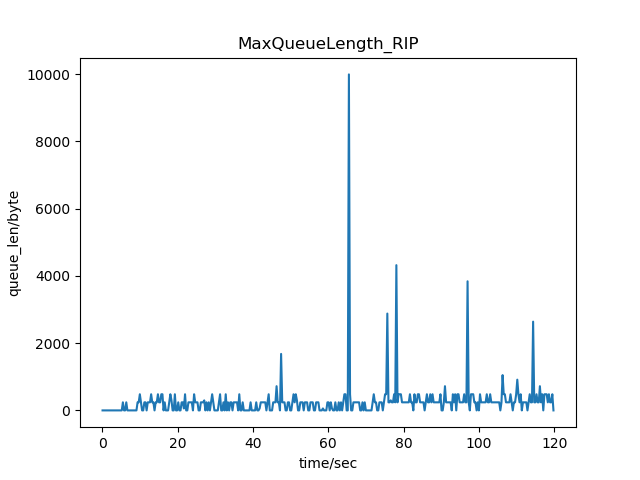
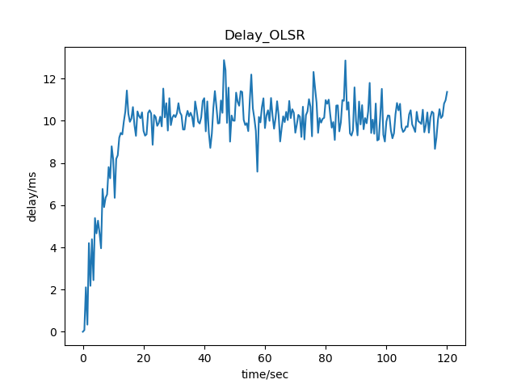
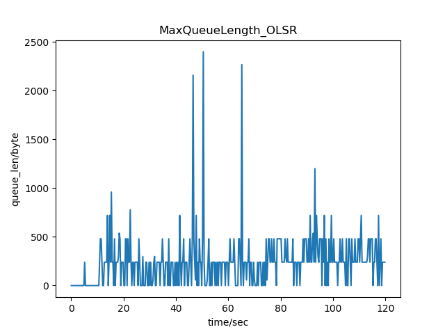

# CS339 Project 2 NS-3 topology routing experiment

## Description:

利用NS-3平台，完成如上网络拓扑图的模拟。

#### Configuration：

* 共30个路由器，50个主机，总测试时间为2min（120s）。

* 每0.1s随机生成一次发送和接收主机对群组（组内主机对数量从1-25内随机生成），通过设计的路由协议进行点对点通信。

* 传输UDP报文大小为210bytes（包括所有首部），每包间隔为3.75ms。

* 链路传输数据率为10Mbps，延迟为2ms。

* 路由器吞吐率（包转发率）为3kpps（每秒处理3000个包），缓存长度为2M，所有路由器配置相同。

* 错误模型的错误率为0.0001。

#### Implementation：

* 使用`topology-read-module`读取./scratch/topo.txt 生成ns-3所需的`nodes`与`links`
* 分别使用 RIP, OLSR, NixVector路由协议进行模拟
* 使用`UdpEchoApplication` 与`PacketSink` 进行数据收发。
* 利用callback机制实现delay计算以及最大队列长度的计算。
* 使用python脚本对模拟数据进行处理。

**Note：** 代码需在ns-3.28以上版本运行，否则会有错误信息

## Experiment Result

| Protocol           | RIP      | OLSR     | NixVector |
| ------------------ | -------- | -------- | --------- |
| Avg_queue/Byte     | 232.5555 | 276.2468 | 283.5813  |
| Max_queue/Byte     | 9994     | 22320    | 9600      |
| Avg_Delay/ms       | 10.0499  | 10.1055  | 10.1129   |
| Max_Delay/ms       | 39.5582  | 65.4520  | 33.7929   |
| Success_trans_rate | 0.9733   | 0.9765   | 0.9781    |
### Graph:

#### RIP:

#### OLSR:

#### NixVector

